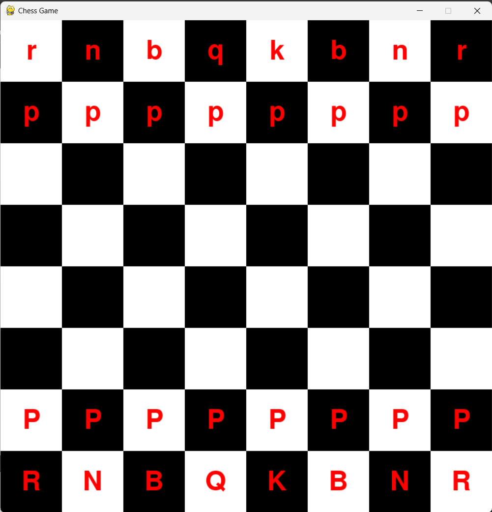

# Chess Layout using Pygame



## Description

This Python program, `chess.py`, is a graphical representation of a chess layout created using the Pygame library. The program does not provide gameplay functionality, but it displays the position of different chess pieces on the board.

## Features

- Beautiful and intuitive graphical representation of the chessboard.
- Clear visualization of the positions of chess pieces.
- Convenient for educational purposes, chess analysis, or custom chess implementations.

## Requirements

- Python 3.x
- Pygame library

## Installation

1. Make sure you have Python 3.x installed on your system.
2. Install the required Pygame library by running the following command:

```bash
pip install pygame
```

## Usage

1. Clone this repository to your local machine or download the ZIP file and extract it.
2. Navigate to the project directory.
3. Run the `chess.py` script using Python:

```bash
python chess.py
```

4. The chess layout will be displayed using the Pygame window.

## Screenshots


## Future Enhancements

- Implement chess piece movement and enable gameplay.
- Add player interactions to play chess against a computer or a human opponent.

## Contributing

Contributions are welcome! If you have any suggestions, bug fixes, or improvements, feel free to open an issue or submit a pull request.

---

We hope you enjoy using this simple chess layout created with Pygame. While it does not support actual gameplay, it can be a useful tool for chess enthusiasts, learners, or developers working on custom chess projects. I love playing chess, and since I was learning python, I thought of creating a chess board using python. Hope you will like it. If you have anything, feel free to ask me via `contact@adit.com.np`